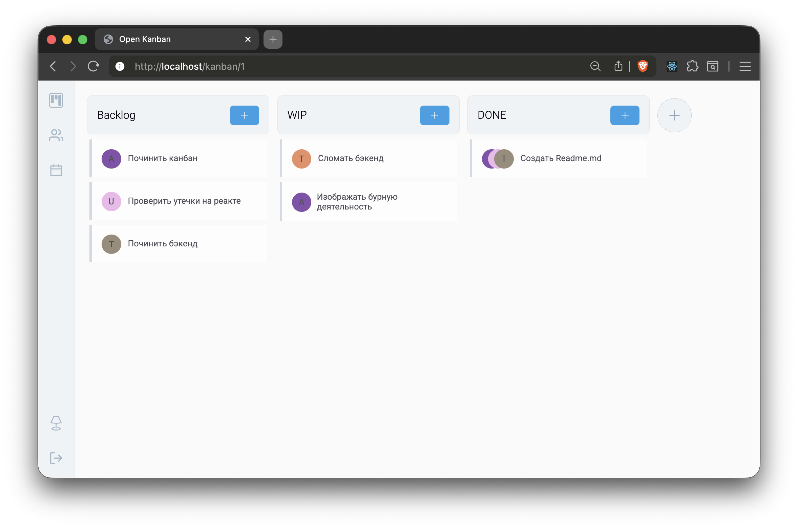

# Open-Kanban

Self-hosted канбан-доска для управления небольшими проектами.

## Требования

- docker v28+

## Установка и запуск

`docker compose up --build`

### Первичная настройка

Для того, чтобы сервис работал, требуется запустить первичные миграции и создать пользователя.
Для этого, после успешного запуска сервиса, требуется выполнить несколько команд:

1. `docker exec -it backend sh` // Войти в окружение сервиса backend
2. `yarn add -D mikro-orm` // Установить cli для работы с версионированием схемы
3. `yarn migration:up`
4. `yarn db:seed`

### Обновление версий

Для обновления версий open-kanban используйте первые 3 команды из предыдущего пункта